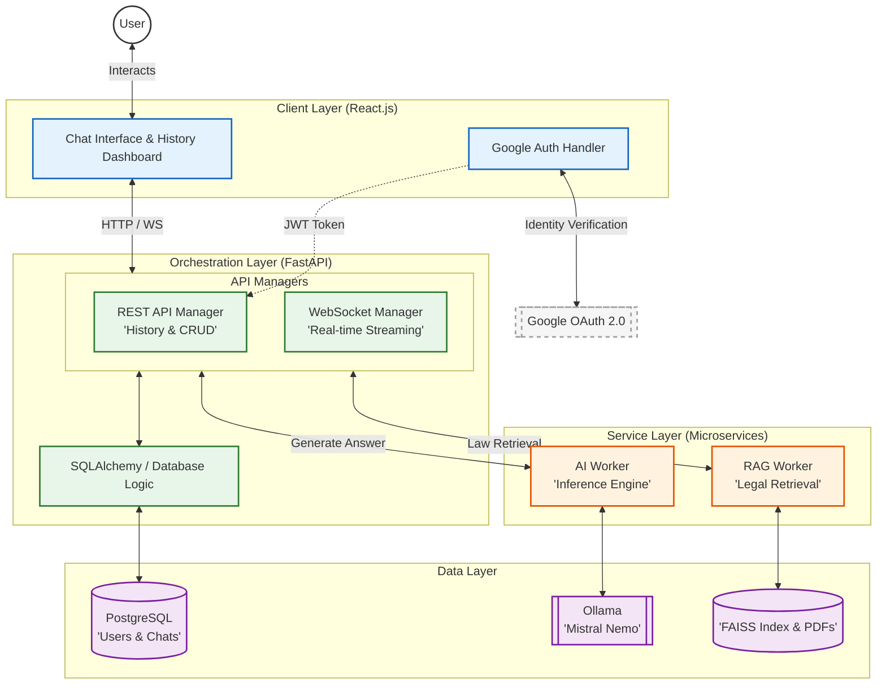

# LegalGPT Nepal 🇳🇵⚖️


**LegalGPT Nepal** is an AI-powered legal advisory system designed to provide accurate, context-aware answers to queries regarding the Constitution and Laws of Nepal. Developed as a **Final Year Computer Engineering Project (IOE, Purwanchal Campus)**, it utilizes a sophisticated multi-stage RAG pipeline to ensure all AI responses are grounded in official legal documents, preventing hallucinations.

---

## 🚀 Key Features

*   **🔍 Hybrid RAG Engine:** Combines **BM25 (Keyword)** and **FAISS (Semantic)** search for high-precision retrieval of legal clauses.
*   **🧠 Fine-Tuned AI Assistant:** Powered by **Mistral 7B Instruct** (quantized via 4-bit QLoRA) for natural, flowing legal explanations.
*   **📜 Verified Citations:** Every response includes direct references to the specific **Law, Chapter, and Section** used as a source.
*   **⚡ Real-Time Streaming:** Instant, token-by-token response delivery via **Asynchronous WebSockets**.
*   **🔐 Secure Sessions:** Enterprise-grade authentication using **Google OAuth 2.0** and JWT session management.
*   **📊 Admin Dashboard:** Full visibility into user interactions and system logs via **SQLAdmin**.

---

## 🏗️ System Architecture (Landscape)

The system follows a microservices-oriented architecture to separate retrieval logic from language generation.



---

## 📂 Project Structure

```text
LegalGPT-Nepal/
├── ai/                         # Inference Microservice (Port 8001)
│   ├── prompts/                # Legal persona & prompt templates
│   ├── ai_worker.py            # Ollama FastAPI bridge
│   └── requirements.txt
├── backend/                    # Main Orchestration API (Port 8000)
│   ├── alembic/                # DB Migrations
│   ├── app/                    # Auth, WS Manager, REST routes
│   ├── docker-compose.yml      # Infrastructure (PostgreSQL)
│   └── requirements.txt
├── frontend/                   # React.js User Interface
│   ├── src/
│   │   ├── hooks/              # WebSocket & API hooks
│   │   ├── sections/           # Modular Chat UI components
│   │   └── store/              # Zustand state management
│   └── package.json
├── rag/                        # Retrieval Microservice (Port 8002)
│   ├── pdfs/                   # Raw Nepalese Law Corpus (PDFs)
│   ├── data/                   # FAISS Vector Index & Metadata
│   ├── ingest.py               # PDF Processing & Embedding pipeline
│   ├── rag_worker.py           # Hybrid Search API
│   └── requirements.txt
└── README.md
```

---

## 🛠️ Tech Stack

| Component | Technology | Role |
| :--- | :--- | :--- |
| **Frontend** | React 19, TypeScript | Vite, Tailwind CSS 4, Framer Motion |
| **Backend** | FastAPI (Python) | Async Orchestration, WebSockets, JWT |
| **Database** | PostgreSQL | User Data & Chat History Persistence |
| **RAG Engine** | FAISS + BM25 | Multi-stage Hybrid Retrieval |
| **AI Model** | Mistral 7B Instruct | Language Generation (via Ollama) |
| **Auth** | OAuth 2.0 | Secure Google Login integration |

---

## 🔍 How the RAG Pipeline Works

To ensure legal accuracy, LegalGPT follows a **5-stage retrieval process**:
1.  **Semantic Search (FAISS):** Captures the intent of the user query.
2.  **Keyword Search (BM25):** Ensures specific legal terms/Section numbers are found.
3.  **RRF Fusion:** Merges semantic and keyword results into a single ranked list.
4.  **Legal Boost:** Prioritizes documents if specific Sections (e.g., "Section 40") are mentioned.
5.  **Cross-Encoder Reranking:** A specialized transformer model re-evaluates the top candidates to select the **Top 3** most relevant legal snippets for the AI context.

---

## ⚡ Getting Started

### 1. Prerequisites
*   Python 3.10+ & Node.js 18+
*   PostgreSQL 15+
*   [Ollama Engine](https://ollama.com/) (Running Mistral Nemo 12B)

### 2. Setup Services
Detailed setup instructions are available in the respective subdirectories:
*   [Backend Setup](./backend/README.md)
*   [RAG Worker Setup](./rag/README.md)
*   [AI Worker Setup](./ai/README.md)
*   [Frontend Setup](./frontend/README.md)

---

## 👥 The Team

| Name | Role | Responsibility |
| :--- | :--- | :--- |
| **Nishan Bhattrai** | Backend Lead | FastAPI Architecture, DB Design, Auth |
| **Rajat Pradhan** | Frontend Lead | React UI/UX, Component Design |
| **Prasanga Niraula** | AI Lead | Model Selection, Fine-tuning, RAG |
| **Yamraj Khadka** | Research Lead | Legal Data Collection, Testing, Documentation |

---

## 📝 License
This project is licensed under the MIT License.

*Submitted as a fulfillment of the Final Year Project, Bachelor of Computer Engineering, IOE Purwanchal Campus.*